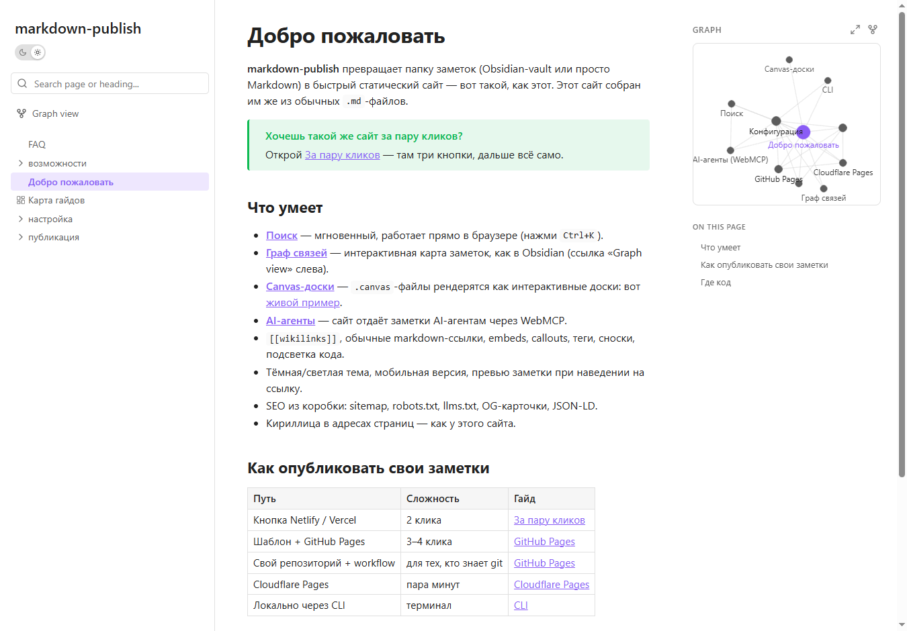
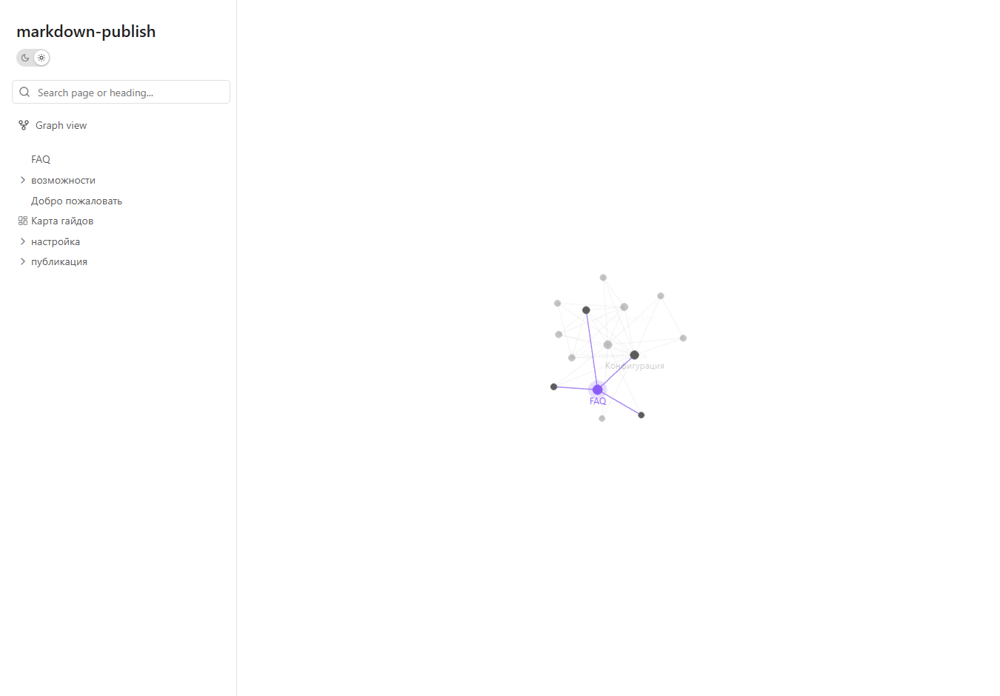
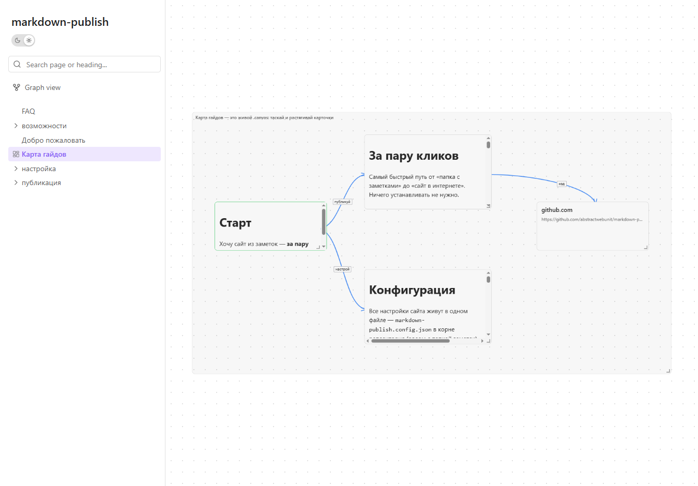
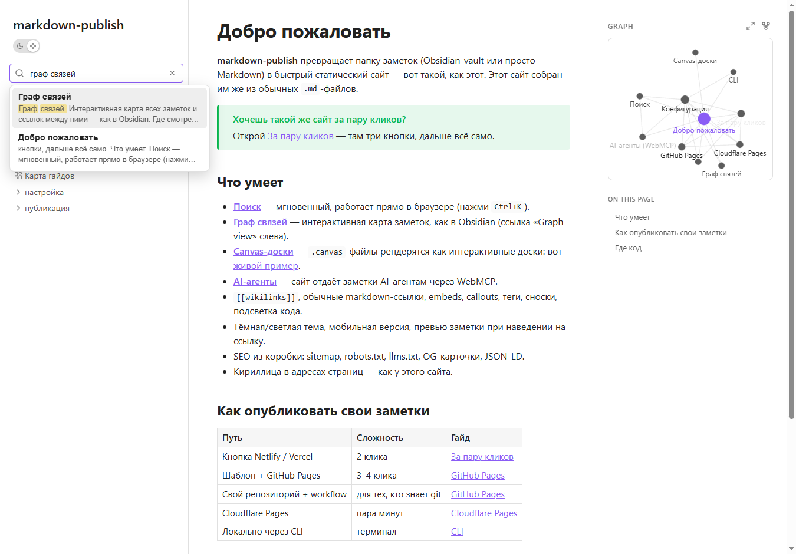

# markdown-publish

**Docs & live demo:** https://abstractwebunit.github.io/markdown-publish-docs/ · **Starter template:** [markdown-publish-template](https://github.com/abstractwebunit/markdown-publish-template)



| Interactive link graph | Canvas boards | Instant search |
|---|---|---|
|  |  |  |

A static-site generator that turns a folder of Markdown notes
(plus `.canvas` boards and assets) into a fast, read-only, searchable website
with a link graph. Built with Angular (zoneless SSG, prerendered) + a build-time
Node parser. No backend, no external runtime dependencies.

It reads Obsidian-style vaults — `[[wikilinks]]`, embeds, callouts, and the open
[JSON Canvas](https://jsoncanvas.org) format — but is an independent project.

> **Not affiliated with, endorsed by, or connected to Obsidian.MD Inc.**
> "Obsidian" is a trademark of its respective owner; it is referenced here only
> to describe vault compatibility (nominative use). All code, styles, and assets
> in this repository are original.

## Build

Requires a recent Node (a portable one lives in `.node/`). Prefix commands with
`export PATH="$PWD/.node:$PATH"`.

```bash
# Parse a vault → build app → search index → SEO files
VAULT="/path/to/vault" \
SITE_NAME="My Notes" SITE_URL="https://notes.example.com" SITE_LANG="en" \
npm run build:site

# Preview the built static output
npm run serve:static    # http://localhost:4301
```

Build env vars: `VAULT`, `BUILD_MODE` (`full`|`public`), `SITE_NAME`,
`SITE_URL`, `SITE_DESCRIPTION`, `SITE_LANG`, `SITE_FOOTER`.

## Scripts

- `build:content` — parse the vault into `src/content`
- `build:app` — Angular production build (prerender)
- `build:index` — Pagefind search index
- `build:seo` — robots.txt, sitemap.xml, llms.txt, 404.html
- `build:site` — all of the above in order

## Publish your vault (CI)

In a repo containing your vault, add `.github/workflows/publish.yml` (or use the
hosted app, which writes it for you):

```yaml
# see templates/publish.yml
```

Or run anywhere as a build command: `npx @abstractwebunit/markdown-publish build --out dist`.
Configure via `markdown-publish.config.json` or flags
(`--site-name`, `--site-url`, `--site-lang`, `--vault-dir`, `--build-mode`).

## License

Original work in this repository is released under the MIT License (see
`LICENSE`).
